# The complete demo guide

`docs/DEMO-SCRIPT.md` is the ten-minute runbook for someone who has driven this
product before. This is the other document: a complete walkthrough for a
colleague who has never opened it, covering every screen and every feature —
not just the ten-minute path.

**Every screenshot in this guide is real product state**, captured against a
running instance by `scripts/capture-demo-screenshots.ts`. Run
`npx tsx scripts/capture-demo-screenshots.ts` (against a local
`npm run start:local`, or pass a URL to shoot the deployed site) to regenerate
every image in `docs/images/demo/` in one command. Nothing here is hand-placed.

---

## Before you start

**Warm the deployment.** A cold serverless start plus the first connection to
Neon in Singapore is about 7 seconds to first byte. If you are presenting,
open the URL two or three minutes ahead of time so the first thing anyone sees
is not a blank tab.

**Which persona for which section.** The role switcher (top right of every
page) is the demo's stand-in for signing in — see §1. A quick reference:

| Persona | Grade | Use it for |
|---|---|---|
| Aarav Agarwal | Partner, Admin | Everything under Admin; releasing an allocated desk |
| Ananya Gokhale | Article | The booking flow — she is the group the policy actually targets |
| Aparna Modi | Manager | Booking on behalf of a colleague; booking a meeting room |
| Anjali Thakkar | Assistant Manager | A second bookable-grade view, if Ananya's desk is already taken in the demo data |
| Vinay Karnik | Director | A fixed-seat holder who is not an admin |
| Amit Deshpande | Admin / HR / IT | Admin access without being a partner |

**If something goes wrong mid-demo**, the fastest recovery is almost always
the clock: press **Reset** on the clock readout (top right, appears once the
demo clock has been advanced), then reload. If the floor looks genuinely
wrong — desks released that should not be, or history missing — that is a
job for `npm run prod:seed -- --yes-production` (production) or `npm run
seed` (local), which rebuilds the eight weeks of demo history from scratch.
Full recovery steps are in `docs/RUNBOOK.md`.

**The shared-clock warning.** `settings.demo_offset_seconds` is one row,
shared by the whole database. If a colleague advances the clock in another
tab or another room while you are mid-demo, it moves for you too, mid-
sentence. Agree who has the clock before two people drive at once.

---

## The ten-minute path

This is `docs/DEMO-SCRIPT.md`, unchanged in substance for Phase 8 — the
occupancy-labels toggle (§4 below) defaults off, so the ten-minute script's
line about bay counts at whole-floor zoom now describes the **shading**
first and the toggle second; the script itself has been updated inline.
Read that document for the minute-by-minute version. Everything below is the
long version.

---

## 1 · Signing in

There is no separate sign-in screen in the demo — the role switcher (top
right of every page) is the visible half of the demo authentication adapter.
Picking a name from it writes a cookie the server reads, exactly the way a
real session cookie would after Entra sign-in in production. Switching does
not preserve anything about who you were: it is a full change of identity,
including admin access.

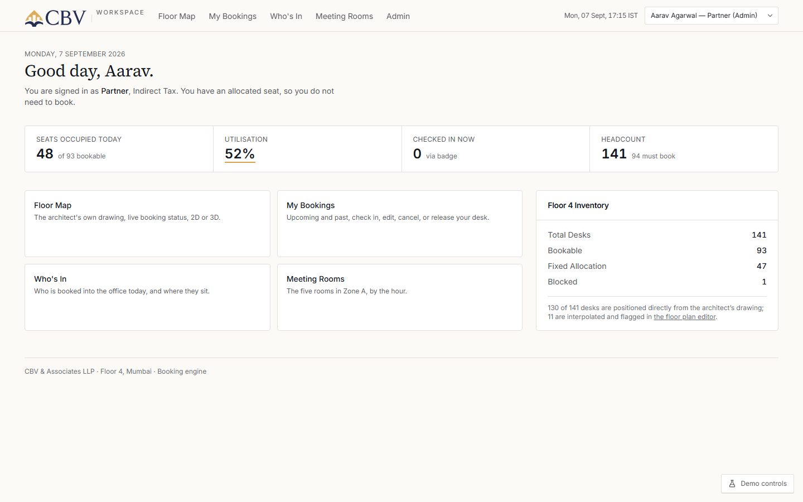

Signed out entirely (which the demo never naturally reaches, since the role
switcher always resolves to a default person — see `docs/ASSUMPTIONS.md` A8
for the production equivalent), the home page shows the full CBVA lockup
instead, which is otherwise reserved for this one surface.

**Do not click:** nothing here can put the demo in a bad state. Switching
identity is safe at any time.

---

## 2 · The Floor Map

The centrepiece. `/floor`, reached from the primary nav on every page.

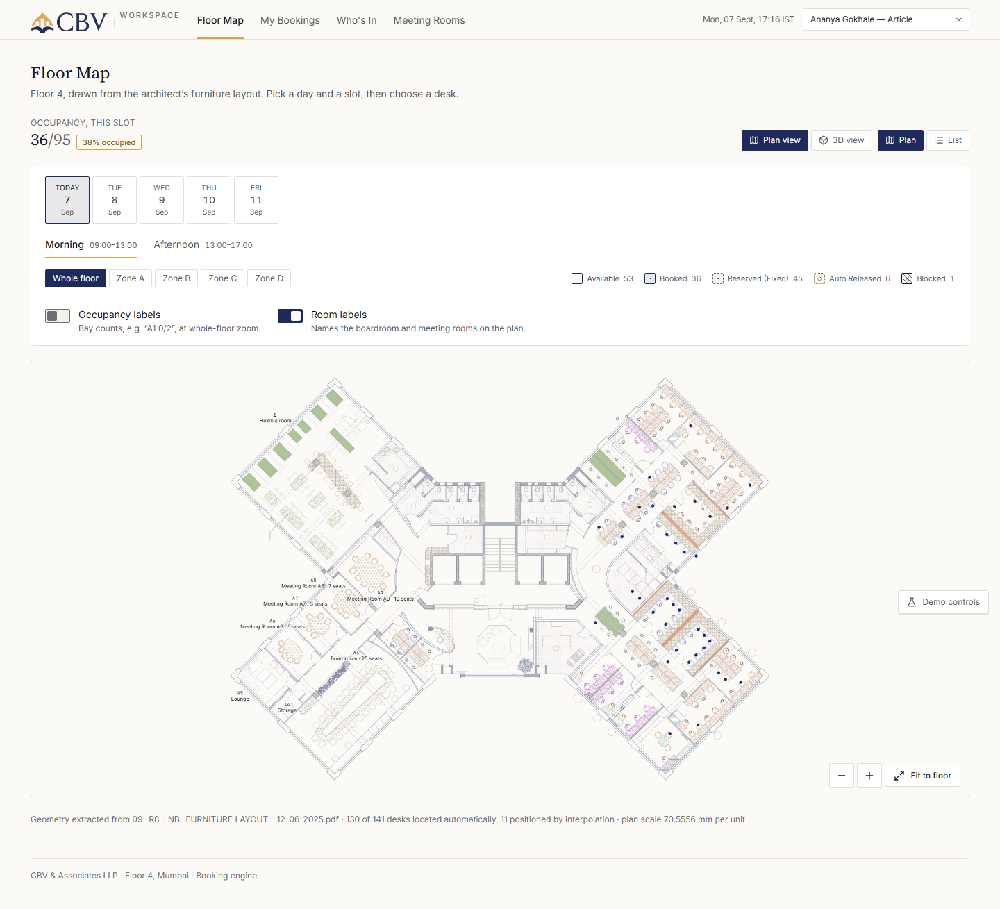

**What it is.** The architect's own furniture layout — not a redrawing, the
actual sheet, in its own colours — with 141 real, clickable desks laid over
it. Sign in as **Ananya Gokhale (Article)** for this section: she has no
allocated desk, so she is the group the whole booking flow exists for.

**The controls, left to right and top to bottom:**

- **Date strip** — the next five working days (configurable in Admin →
  Settings), skipping weekends and holidays automatically.
- **AM / PM tabs** — the two seeded slots. Slots are data, not a fixed pair;
  moving to hourly booking is a settings change (see Admin → Settings, §14).
- **Zone filter** — Whole floor, or one of A–D.
- **Occupancy labels** and **Room labels** — two independent toggles, new in
  Phase 8:
  - *Occupancy labels* (bay counts like "A1 0/2") are **off by default**. At
    whole-floor zoom, individual seven-status colours are illegible in
    principle — a desk is about 11 pixels across — so each seat instead
    paints as a plain dot, **filled navy if held, hollow if free**. That
    density read survives the toggle being off; the toggle adds the exact
    per-bay fraction on top when switched on.
  - *Room labels* ("A3 Boardroom · 25 seats") are **on by default**. Zones A
    and B hold the boardroom, the four meeting rooms and a flexible room —
    zero bookable desks between them — and without these labels those wings
    read as broken rather than as furnished rooms.

  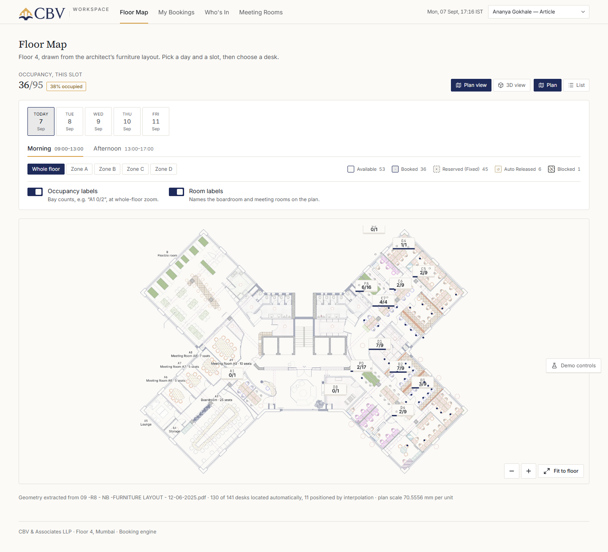

- **Plan / List** — the same 141 seats as an accessible table instead of a
  drawing. This is the keyboard- and screen-reader-first path; nothing here
  is exclusive to the visual plan.

  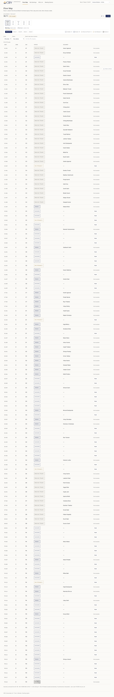

- **Plan view / 3D view** — a second rendering of the identical data, not a
  separate feature. Pick a desk in 3D and switch to 2D: the same desk is
  still selected, because selection is one shared value.

  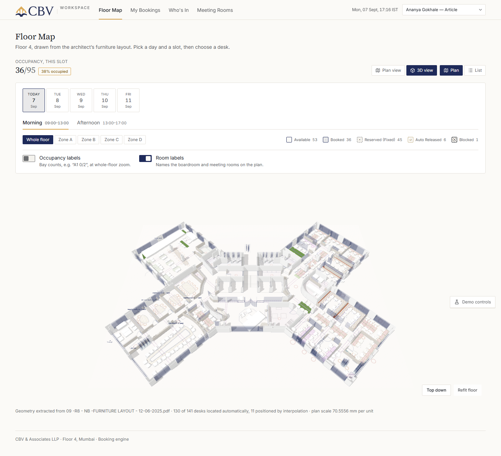

  In 3D, "Top down" resolves the model into the architect's own drawing —
  the point being made is faithfulness, not decoration. If the browser
  cannot give the page a WebGL context, or loses one mid-session, the view
  falls back to the 2D plan with a one-line notice rather than a blank
  canvas — this is deliberate (ADR-032) and not a bug if you see it.

**Selecting a zone** reframes the plan to that wing and always lands on
per-seat detail, never bay chips — a zone pick is "show me this wing's
desks," a distinct signal from ambient zooming.

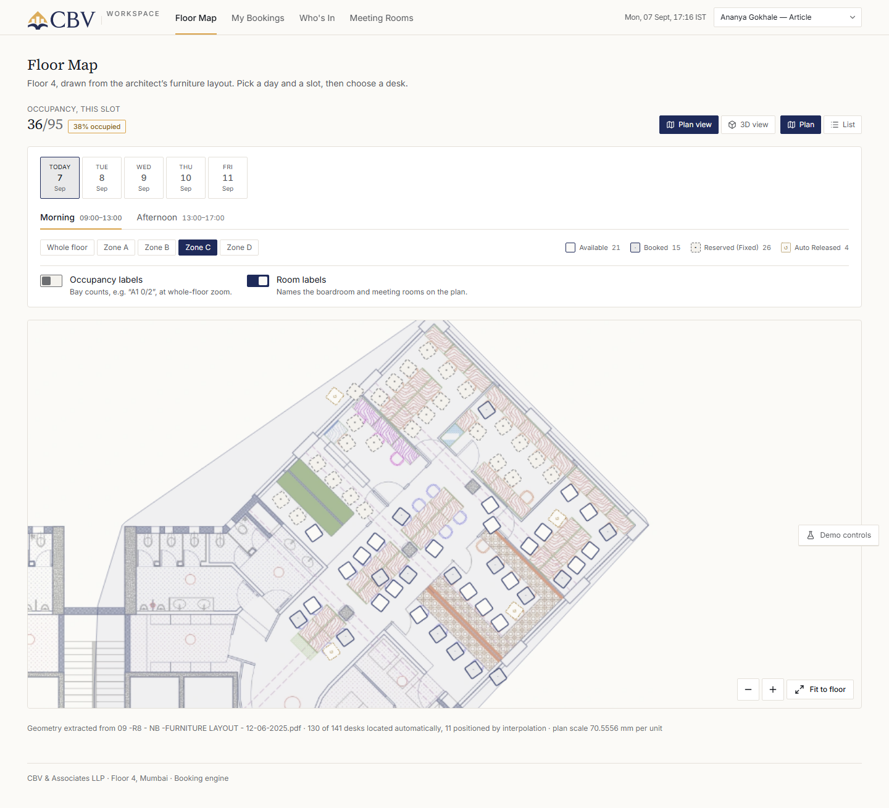

**Booking a desk.** Click any seat with a navy outline and empty fill
(available). The dialog shows the seat, the date, and the slot before asking
for confirmation — nothing is booked by a single click on the plan itself.

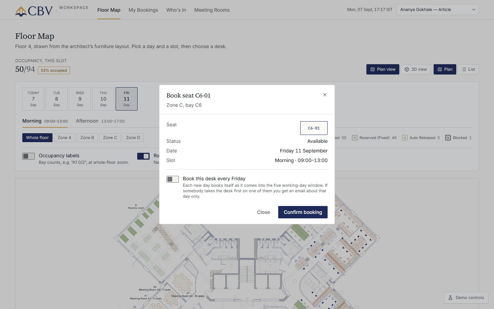

Toggle **"Book this desk every [weekday]"** to make it recurring — each new
day books itself as it enters the five-day window, and if somebody else
takes the desk first on one occurrence, only that day is affected; the
series continues.

**Booking on behalf of someone else.** Sign in as **Aparna Modi (Manager)**
or **Aarav Agarwal**. The booking dialog gains a person picker restricted to
staff who are themselves eligible to book — only Managers, Directors,
Partners and Admin/HR/IT staff may book for a colleague, and only for a
bookable-grade colleague, never for another fixed-seat holder.

**What NOT to click:** avoid repeatedly booking and cancelling the same desk
across many rehearsals — it is real data, and `npm run seed` is the reset if
the floor starts looking picked-over. Do not open `/admin/floor-plan` mid-
demo and drag anything unless you mean it — it writes back to the committed
geometry file (§13).

---

## 3 · My Bookings

`/bookings`. Sign in as **Ananya Gokhale**.

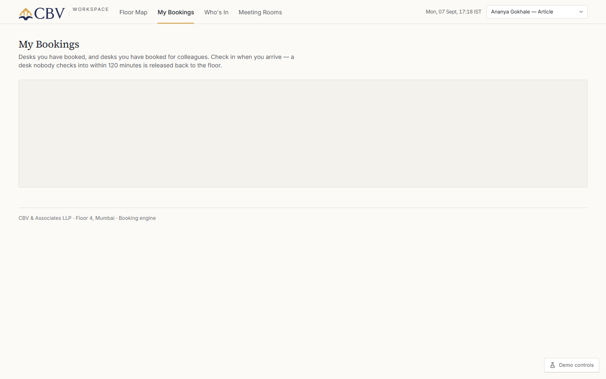

Three tabs: **Upcoming**, **Past**, and **My desk**. Upcoming and Past are
what they say — every booking Ananya made or that was made for her, with
Edit and Cancel up to the cut-off. **My desk** is where a recurring series
and (for a fixed-seat holder) a desk release live:

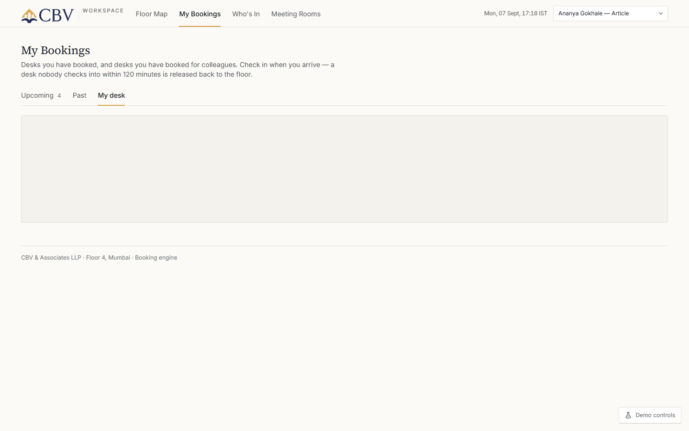

**Releasing an allocated desk.** Sign in as a fixed-seat holder — **Aarav
Agarwal** or **Vinay Karnik** — and open My desk. "Release for [date]" hands
the desk back to the pool for that day. This is the *only* mechanism by
which any of the 47 allocated desks are ever measured: an empty allocated
desk that is never released is counted as neither used nor free, because
nobody told the system it was available. Say this part slowly if presenting
to a partner — it is the line that usually lands.

**Editing a booking** is a cancel-and-rebook inside one transaction: if the
rebook loses a race (someone else took the desk in the same instant), the
original booking is left intact rather than the person losing their desk
entirely.

**What NOT to click:** cancelling a booking here is real and immediate.
Don't cancel something you want to show checked-in later in the same demo.

---

## 4 · Checking in

Two independent signals exist, and the product deliberately never blends
them.

**Desk QR check-in** — the strong one. `/checkin/[seatCode]`, reached by
scanning the sticker printed on a physical desk (see §13, the QR sheet).
Signed in and holding that booking, scanning confirms occupancy at the
**desk** level.

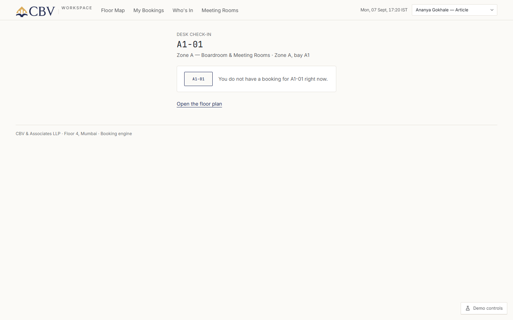

**Simulated badge check-in** — the demo panel's stand-in for a door reader.
See §5. A badge proves someone reached the **floor**, not which desk they
used; `bookings.check_in_method` records which kind of evidence each
check-in is, and the analytics keeps them apart on purpose (§9).

**What NOT to click:** checking in to a desk that is not actually booked for
the current persona will be refused by the product — that refusal is
correct behaviour, not a bug to route around.

---

## 5 · The demo clock and auto-release — the part that proves the product is real

The **Demo controls** panel, bottom right of every page (flask icon).

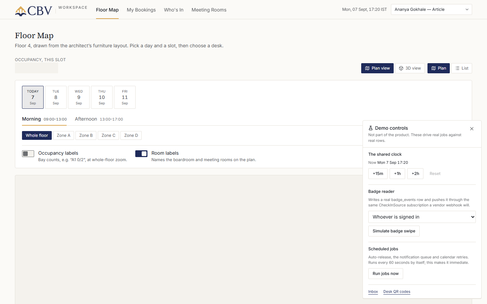

**+15m / +1h / +2h** advance the shared clock. This is not a simulation:
advancing it moves a row in the database that both the server and every
browser read as "now," and the **real** scheduled auto-release job — the
same one Vercel's cron runs every five minutes in production — evaluates the
**real** two-hour rule against **real** bookings. **Run jobs now** triggers
that job immediately rather than waiting for its own interval, so the effect
is visible without a real wait.

The script: pick an Article's desk on today's date, advance the clock two
hours past the slot's start, run the job, and watch the desk's status change
to **Auto Released** (dotted outline, ↺) on the floor plan. Then check
Admin → Outbox (§16) — the release email is already there, because it was
written inside the same transaction as the release itself.

**Simulate badge swipe** picks a person and pushes a real row into
`badge_events` through the same subscription a vendor webhook would use in
production.

**Always press Reset before moving on.** Leaving the clock advanced is the
single most common cause of "the floor looks wrong" in a later demo — see
the troubleshooting table.

---

## 6 · Who's In

`/who`. The screen people actually open day to day, per every review of this
product category: the reason someone opens a desk-booking app is to find out
whether their team is in.

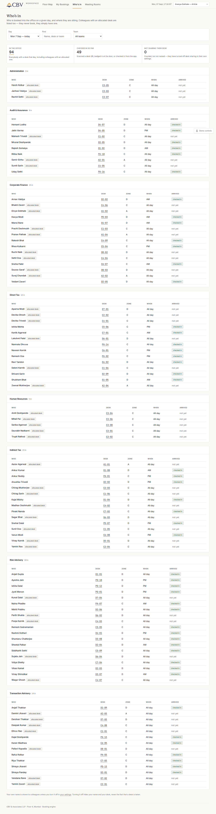

Filterable by day, name/desk/team, and team. Fixed-seat holders are listed
alongside bookable-grade staff — a roster that omitted partners and managers
would be missing most of the people being looked for. Each row shows their
desk, when they are in, and whether they have arrived.

**Coworker visibility.** A person can hide their name from this screen (but
never the fact that their desk is taken) — see §7.

---

## 7 · Your Settings

`/me`. One control: whether colleagues can see your name and desk on Who's
In.

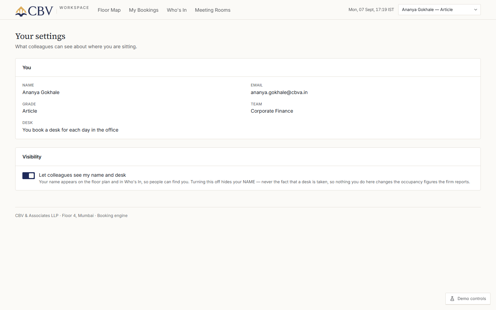

Turning it off hides the *name* only. It never changes whether the desk
reads as taken, and it changes nothing about the occupancy figures the firm
reports — that property is what makes the opt-out safe to offer at all.

---

## 8 · Meeting Rooms

`/rooms`. Sign in as **Aparna Modi (Manager)** or above — booking a room
follows the same eligibility as booking a desk on behalf of someone.

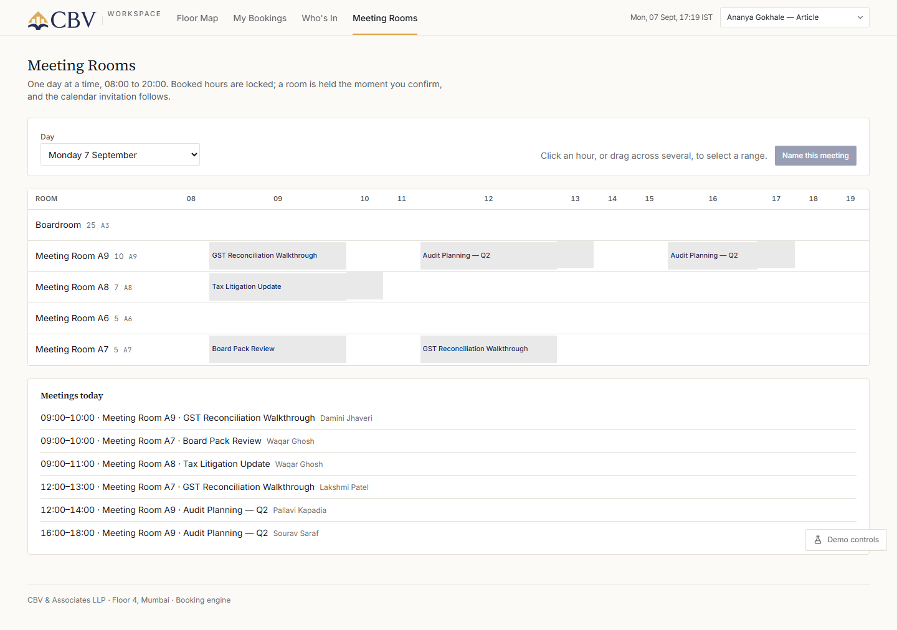

One day, office hours, all five rooms (all in Zone A: the Boardroom seats
25; A9, A8, A7 and A6 seat 10/7/5/5). Click or drag across the grid to
select a range and confirm. **A room cannot be double-booked** — the same
database-level guarantee as desks, not an application check — and a
successful booking is pushed to the calendar sync automatically, with a
retry if Graph is unreachable at that moment.

**What to say if asked "we book rooms in Outlook today":** this is the
single open question most likely to embarrass the product in front of
staff — see §17 and `docs/OPEN-QUESTIONS.md` §3.

---

## 9 · The analytics — four screens, and this is what was actually bought

`/admin/analytics*`. Sign in as **Aarav Agarwal**.

### Trends — the headline

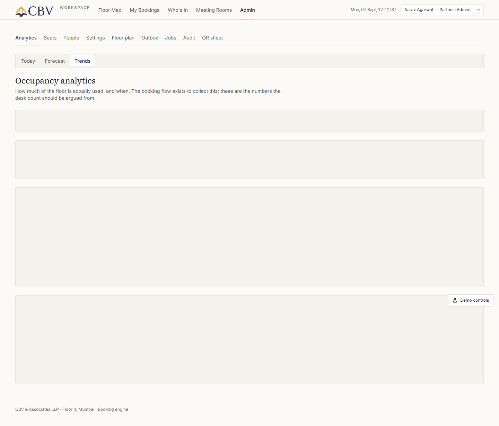

Read the boxed headline sentence aloud if presenting — it names the peak,
the 95th percentile, the median, and the bookable pool, together with the
two open questions that still bound the denominator. Below it: seats booked
by day, the Tuesday-busiest / Monday-quietest shape a one-day-a-week WFH
policy makes, and the bay heat map (each bay against its **own** desk
count — a small bay that stays full reads as dark as a large one, which is
the fix for a defect Phase 5 found and corrected).

**The three measures**, side by side rather than one chosen number: seats
booked, seats attended, seat-hours consumed. The **Measure** dropdown and
the panel beside it explain each — the firm has not told us how an
auto-released no-show should be charged, so all three ship rather than
picking one and hiding an assumption inside it.

### Today

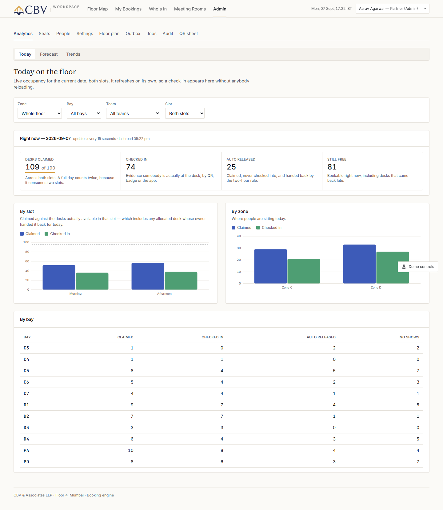

Refreshes on its own; both slots, current day.

### Forecast

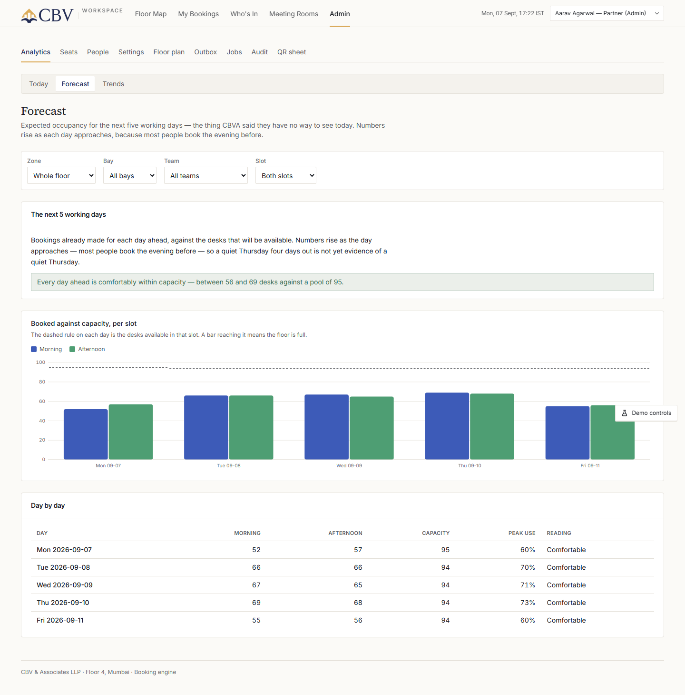

The thing partners specifically said they had no way to see before this
existed: whether tomorrow is filling up, ahead of it arriving. Numbers
climb as each day approaches, since most people book the evening before.

### Exports

Every analytics screen has a matching CSV export over the exact filters on
screen — press it in the filter bar. Three kinds: bookings (raw rows),
occupancy (by day/slot), and utilisation (per desk).

**What NOT to click:** the range picker accepts arbitrary custom ranges; a
very wide one (the full eight weeks plus) is slower, not broken — give it a
few seconds rather than assuming it has failed.

---

## 10 · Admin index

`/admin`. The eight tools, one line each.

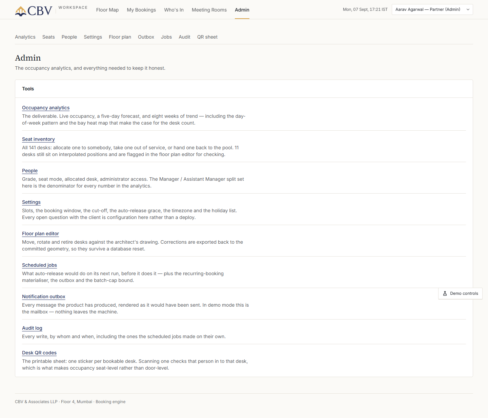

---

## 11 · Seat inventory

`/admin/seats`. All 141 desks.

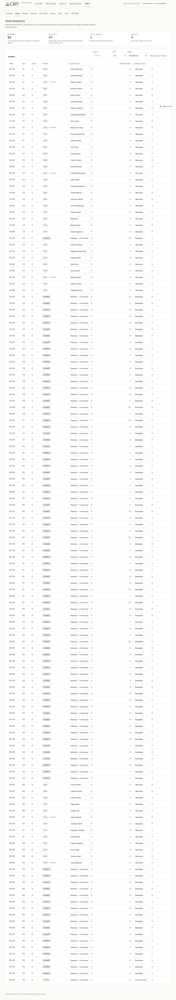

Allocate a desk to a person (answers open question A2 — which physical
desks are fixed, and to whom), take one out of service, or hand one back to
the bookable pool. Live booking counts per desk, and provenance (detected
from the drawing vs. interpolated) is visible per row.

---

## 12 · People

`/admin/users`. The staff roster.

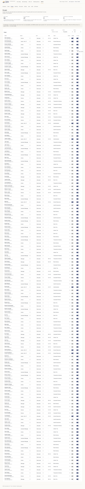

Grade, team, allocated desk, admin access, and the attendance-visibility
default, all editable per person. **This is where the single most important
open question is answered**: the Manager / Assistant Manager split, which
sets the denominator for every occupancy figure in the product. See
`docs/OPEN-QUESTIONS.md` §1.

---

## 13 · Settings

`/admin/settings`. Every configuration value the product reads.

Slot definitions (including moving to hourly booking — a settings change,
not a rebuild), the booking window, the cut-off, the auto-release grace
period, the public holiday list, office hours, zone display names.
**Everything CBVA can change without a developer** lives on this one screen.

---

## 14 · Floor plan editor

`/admin/floor-plan`. Drag, rotate, or retire a desk against the architect's
drawing.

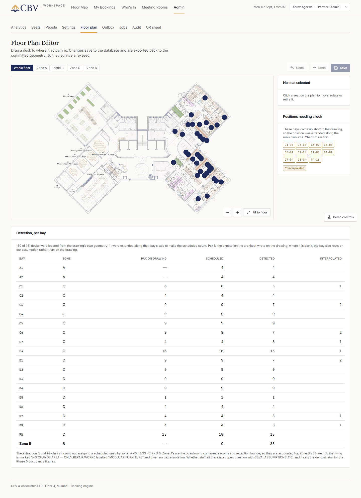

Eleven desks are still flagged **interpolated** — positioned by continuing
their bay's own axis, because the drawing genuinely does not say where those
specific eleven chairs are. This screen is where somebody who knows the
floor closes that in about fifteen minutes: drag each into place, press
Export, and the correction writes back into the committed `seats.json` file
as a reviewable diff, surviving every future rebuild and database reset.

**What NOT to click:** do not drag desks casually while demonstrating this
screen unless you intend to Export — an unexported drag is harmless (nothing
is saved without pressing Save then Export), but get in the habit of
pressing **Undo** (Ctrl+Z) rather than leaving stray edits sitting.

---

## 15 · Scheduled jobs

`/admin/jobs`.

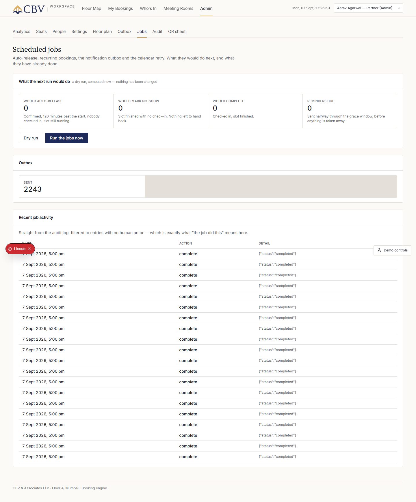

What the auto-release job, the recurring-booking materialiser, the
notification outbox and the calendar retry would each do on their next run
— and what they have already done. The batch-cap bound (a safety valve that
applies *nothing*, not a partial batch, if a single run would touch an
implausible number of rows) surfaces here if it has ever tripped.

---

## 16 · Notification outbox

`/admin/notifications`. In demo mode, this **is** the mailbox — nothing
leaves the machine.

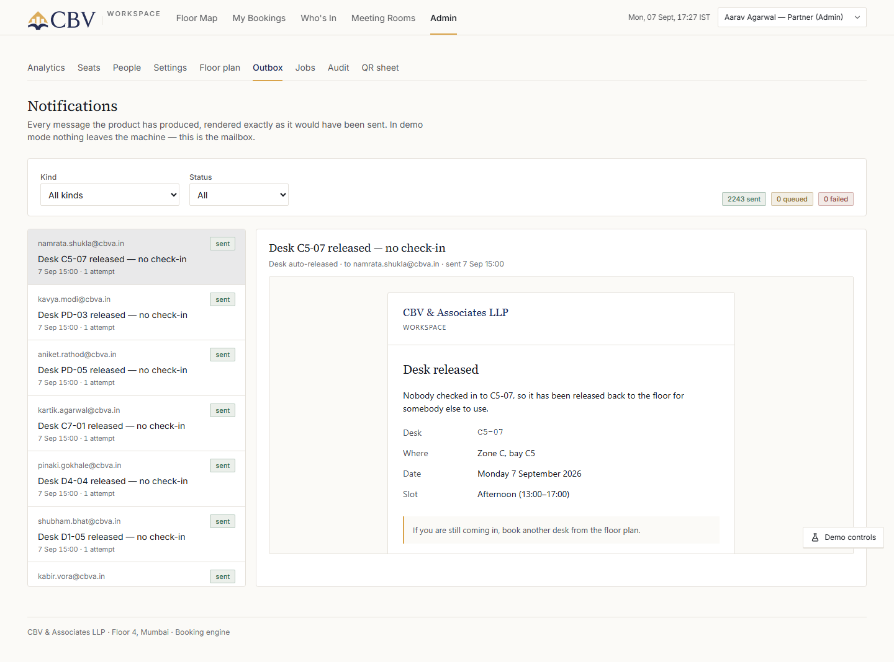

Every message the product has produced, rendered exactly as it would have
been sent, with delivery attempts and a retry action for anything that
failed. A booking's message is written inside the same transaction as the
booking itself, so a committed booking can never exist without its
notification existing too.

---

## 17 · Audit log

`/admin/audit`.

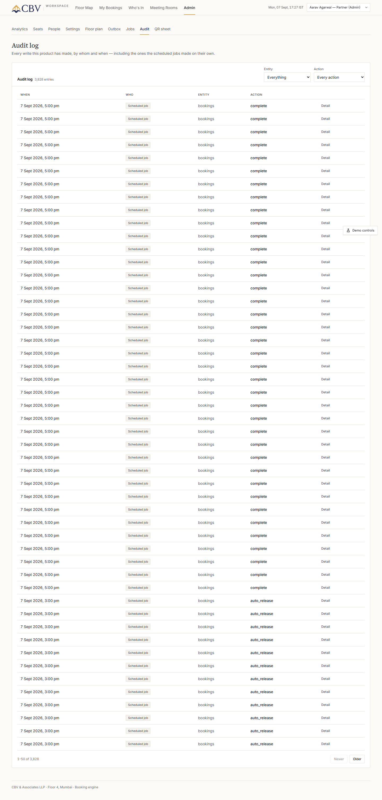

Every write the product has made, by whom (or by which scheduled job, for
the ones nobody clicked), filterable by entity, action, actor and date. This
is where "who changed this desk's allocation, and when" gets answered.

---

## 18 · Desk QR codes

`/admin/qr`. The printable sheet.

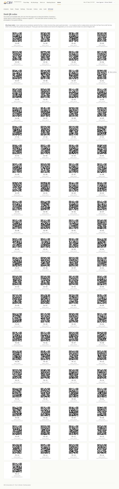

One sticker per bookable desk, twelve to an A4 page, each carrying the URL
that lands on the check-in page in §4. This is what makes occupancy
desk-level rather than door-level.

---

## 19 · Style guide

`/styleguide`. Not part of the product for staff, but worth a visit if
anyone asks about the design system.

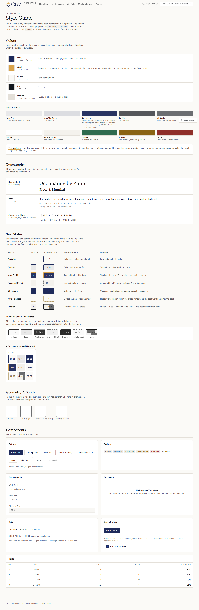

The full token palette, the seven seat statuses with their non-colour cues,
and — the test that actually matters — the same seven statuses rendered
desaturated, side by side, to prove the vocabulary survives greyscale
printing and colour-vision deficiency without relying on hue at all.

---

## What to say when the client asks about an open question

Short answers; the full versions are in `docs/OPEN-QUESTIONS.md`, and that
file is written to be sent as-is.

**"Where did the Manager/Assistant Manager numbers come from?"**
> We invented them, and it is the single most important number in the
> product — it sets the denominator for every occupancy figure. We need your
> HR list: name, grade, team, allocated seat or not. It is typed into Admin →
> People, not deployed.

**"Nobody sits in that north-west wing." / "People do work there."**
> That is the second open question. Your drawing shows it as a flexible room
> — no desks, no seat-count annotations, eight foldable tables on castors —
> but a drawing cannot say how you actually use it day to day. If people do
> work there, the bookable pool is nearer 115 than 93 and every percentage on
> the Trends screen comes down by about a quarter.

**"We already book meeting rooms in Outlook."**
> Then we have a decision to make together before go-live, and it is the one
> most likely to embarrass this in front of your staff. Our constraint
> against double-booking is airtight for bookings made here and blind to
> anything booked in Outlook, and our calendar sync only goes one way today.
> You choose: rooms are booked exclusively here, or we build a two-way sync.
> Desk booking is completely unaffected either way.

**"Why do Zones C and D just say 'Zone C' and 'Zone D'?"**
> Your drawing labels the wings but never says what the teams in them do,
> and we would rather leave it plain than guess on your own screen. If they
> map to specific teams, tell us and it is one line in Admin → Settings.

**"Are those the right 47 desks marked as reserved?"**
> Almost certainly not exactly — we invented that specific allocation. It is
> a dropdown per desk in Admin → Seats; you can correct all 47 in about five
> minutes.

**"Are those eleven desks in the right place?"**
> They are our best inference from the drawing's own measured spacing, not a
> reading of the drawing itself — it genuinely does not say where those
> eleven chairs are. Fifteen minutes in the floor plan editor with someone
> who knows the floor closes it for good, and it does not affect any
> occupancy number, only where those eleven desks are drawn.

---

## Troubleshooting

| Symptom | Cause | Fix |
|---|---|---|
| The floor looks empty, or desks are auto-released that should not be | The demo clock is advanced | Press **Reset** on the clock readout, then **Run jobs now** in the demo panel if a job needs to catch up |
| A screen is stuck loading | Cold serverless start (first load after a quiet period) or Neon's Singapore round trip | Give it 5–10 seconds; if it persists, reload once |
| One card on a page says "could not be drawn" | A widget error boundary caught something — the rest of the page is unaffected | Reload; if it recurs, it is worth reporting, but it will never take down the whole screen |
| You are signed in as the wrong person | The role switcher, top right, is a demo-only control | Pick the right name from the dropdown |
| The 3D view shows the 2D plan with a small notice instead | No WebGL context available, or one was lost | This is the designed fallback (ADR-032), not a failure — continue with the plan view |
| Booking a desk fails with "someone just took that desk" | A genuine race — the database constraint did its job | This is correct behaviour, not a bug; pick a different desk |
| The floor's history looks thin, or a whole section is empty | An interrupted seed, or the e2e suite was run against this database | `npm run seed` (local) or `npm run prod:seed -- --yes-production` (production) rebuilds the eight weeks of history |
| A screenshot in this guide looks stale after a UI change | Expected — screenshots are generated, not maintained by hand | `npx tsx scripts/capture-demo-screenshots.ts` regenerates every image in one command |
